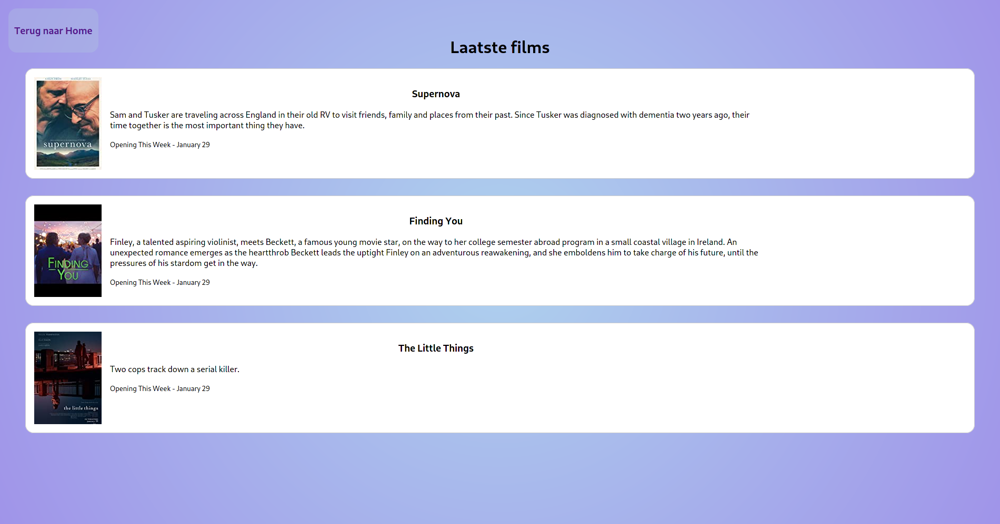

## Summary

This app is built with React and features basic functionalities such as a login. The app is built for an assignment from Novi.

Home screen


Movies screen


## Imdb Api

We are going to use the Imdb api and therefore we need a api key. As I don't really care about this Api you can use my Api key: k_oovbykn6
The key is already defined in the code.

*Note the api is limited to 100 request a day*

## Installation

If you have Nodejs installed it should have come preloaded with Npm.
In that case you can just run:

```npm
npm install
```

After it is ready start the app

```docker
npm start
```

## Login

A default user is already filled in the login field but here are the credentials anyway.

Email: welkom@gmail.com\
Password: Welkom123

You can also create new users.

## Other

To find more commands please consult the documentation:
[Npm](https://docs.npmjs.com/cli/v6/commands).
