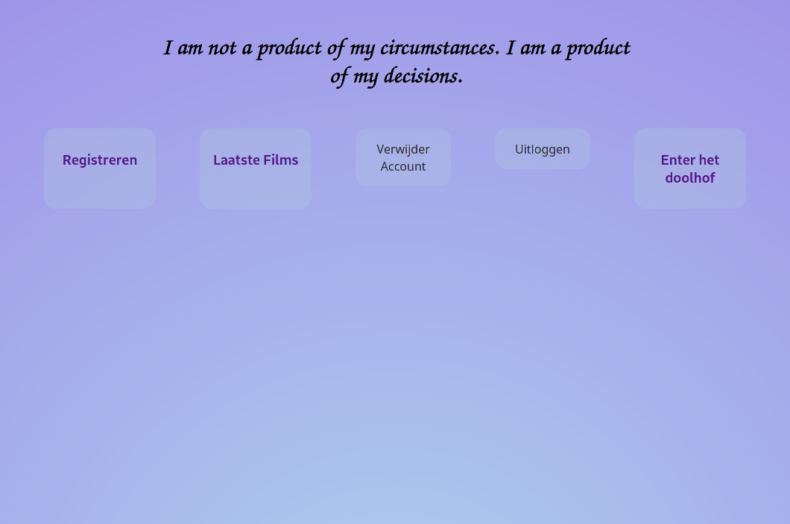

## Summary

This app is built with React and features basic functionalities such as a login. The app is built for an assignment from Novi.

Home screen


Movies screen


## Imdb Api

We are going to use the Imdb api and therefore we need a api key. As I don't really care about this Api you can use my Api key: k_oovbykn6
The key is already defined in the code.

*Note the api is limited to 100 request a day*

## Installation

I have chosen to make my own back-end for learning purposes but because the back-end is rather hard to install I made docker containers.


```docker
// Create the images with the applications in it
docker-compose up -d
```

After it is ready we create the user

```docker
// Used to generate tokens and create a default user.
docker-compose exec back-end composer start
```

## Login

A default user is already filled in the login field but here are the credentials anyway.

Email: welkom@gmail.com\
Password: Welkom123

You can create new users once logged in.

## Other

To find more commands please consult the documentation:
[Docker documentation](https://docs.docker.com/).
