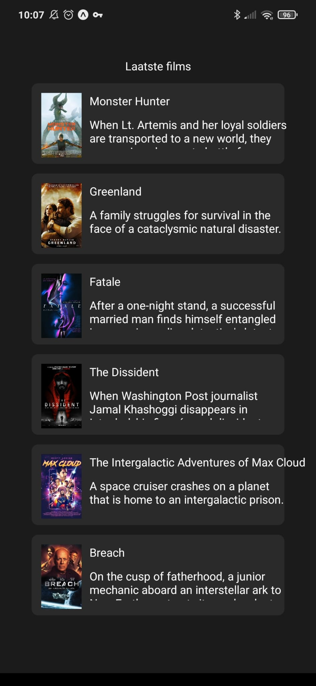

## Summary

This nativeApp is created with React native can be used on IOS and Android. The app can be used consult the latest movies from the IMDB Api.



## Imdb Api

We are going to use the Imdb api and therefore we need a api key. As I don't really care about this Api you can use my Api key: k_oovbykn6
The key is already defined in the code.

*Note the api is limited to 100 request a day*

## Installation

Unlike the web version this app does not use docker to run it. I found it was easier to run it directly on the host because Expo uses a lot of resources from it.

Following the basic installation

```npm
// Install expo global on your machine
npm install --global expo-cli

// And install the dependencies of the project
npm install
```
Now the package are installed we can run expo

```npm
expo start
```

This will start the app, a QR code will be shown in the terminal which you can scan with the Expo app. Also you can press **i** to open an IOS simulator *(note this only works on apple devices)*.

Pressing **a** will create a android emulator or connect to a device using ADB.

And at last pressing **w** will open a preview in the browser.

## Other

There is no login in the app so no login credentials are needed.

To find more commands please consult the documentation:
[Expo](https://docs.expo.io/workflow/expo-cli/#commands) and [Npm](https://docs.npmjs.com/cli/v6/commands).
